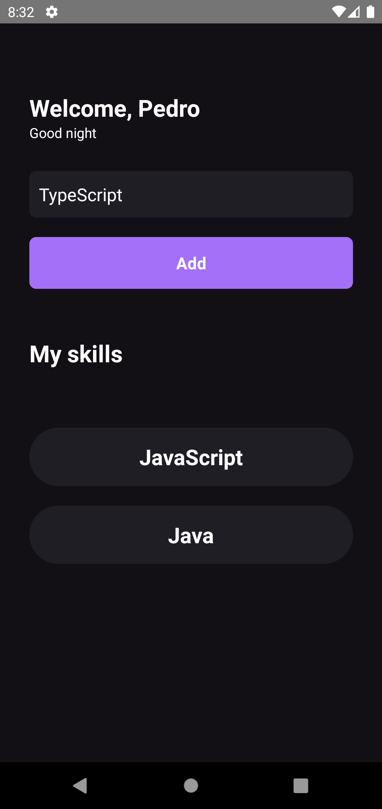

<h1 align="center">
     myskills
</h1>

## 💻 Sobre o projeto

Projeto de um aplicativo mobile para cadastro das suas skills, desenvolvido durante o **Ignite de ReactJS** oferecida pela [Rocketseat](https://www.rocketseat.com.br/ignite/).

---

## ⚙️ Funcionalidades

- [x] Cadastro, exclusão e listagem das skills.

---

## 🎨 Layout

<p align="center" style="display: flex; align-items: flex-start; justify-content: center;">
  
</p>

---

## 🚀 Como executar o projeto

### Pré-requisitos

Antes de começar, você vai precisar ter instalado em sua máquina as seguintes ferramentas:
[Git](https://git-scm.com), [Node.js](https://nodejs.org/en/).
Além disto é bom ter um editor para trabalhar com o código como [VSCode](https://code.visualstudio.com/)

#### 🧭 Rodando a aplicação web (Frontend)

```bash
# Clone este repositório
$ git clone git@github.com:PedroZago/react-native-ignite-myskills.git
# Acesse a pasta do projeto no seu terminal/cmd
$ cd myskills
# Instale as dependências
$ yarn install
# Execute a aplicação em modo de desenvolvimento
$ yarn start
# Inicia um servidor do packager Metro
$ yarn android "or ios"
# Abre o emulador e executa a aplicação
```

---

## 🛠 Tecnologias

As seguintes ferramentas foram usadas na construção do projeto:

#### **Website**  ([React Native](https://reactnative.dev/)  +  [TypeScript](https://www.typescriptlang.org/))

-   **[Babel](https://babeljs.io/)**
-   **[Metro](https://facebook.github.io/metro/)**

---

## 📝 Licença

Este projeto esta sobe a licença [MIT](./LICENSE).
